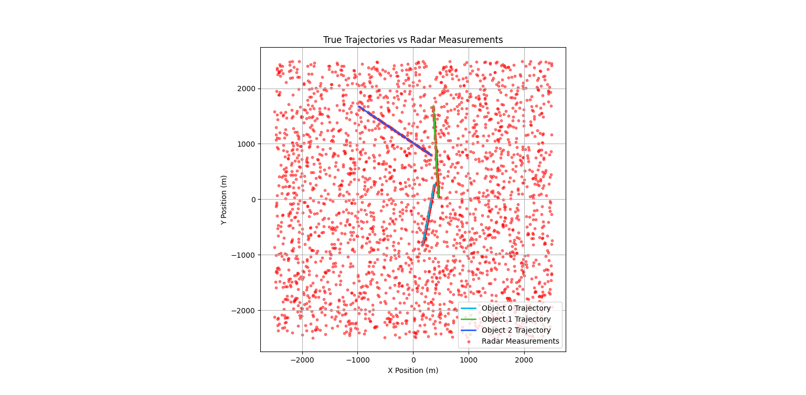
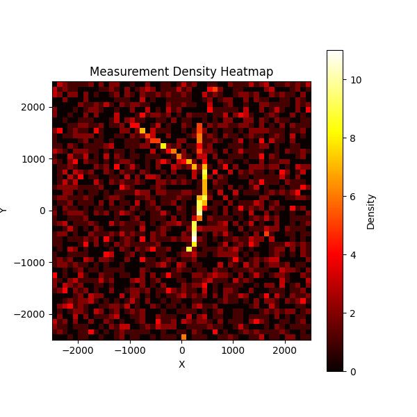

# Full Stack Radar Signal Tracking Project  
A Python radar tracking simulation with backend and frontend implmentations featuring a constant‑velocity Kalman filter, gating, nearest‑neighbor and PDA association, and, hidden within the backend scripts, a performance comparison between Python and C++ engines. This project creates a web app that simulates 1-5 objects (depending on the user's choosing) with random initial positions and random constant velocities, simultaneously capturing measurments of each using state estimation due to the addition of clutter, uncertainty, and overall simulation of "noisy" data measurements (an attempt at mimicking "realistic" radar tracking). Parameters and metrics can be altered within the application such as the amount of measurements per frame, spread of measurments, etc., producing side by side ocmparisons of the true position and filteres measurments.

### Example Ouputs (Chose to track 3 different objects)

  
  

---

## 🚀 Features

### 🧠 Tracking Algorithms
- Constant‑Velocity Kalman Filter (predict + update)
- Mahalanobis distance gating
- Nearest‑Neighbor (NN) association
- Probabilistic Data Association (PDA)
- Full simulation of clutter, noise, and target motion 

### ⚡ Hybrid Python/C++ Engine (NOTE: This is NOT apart of the web app, this is within the Main.py file, which I used for debugging and code testing)
- Python implementation for clarity and debugging
- C++ implementation for speed and performance (personal interest in performance comparisons and an excuse to use C++)

### 📊 Performance Benchmarking
The simulation measures:
- Python vs C++ predict time
- Python vs C++ update time
- Gating time
- Association time
- Per‑frame total time
- Total runtime

All timing is collected automatically and summarized at the end of the run.

### 🎨 Visualization & UI
- Created frontend framework using Streamlit to create an application for the user to choose initial conditions and execution speed of the simulation as well as get visualizations to see the object in motion as well as how my tracking simulation produces estimated measurements using filtering and data association methods

- Plots for:
  - True trajectory
  - Estimated trajectory with: clutter, all measurements from all frames, and visual path to show estimated trajectory
    
---

### How to Run
1. Install dependencies: pip install -r requirements.txt
   
2. Start the backend (FastAPI): uvicorn BackendLogic:app --reload

3. Start the frontend (Streamlit): streamlit run app.py

4. Open the application: Visit the URL shown in the terminal (typically http://localhost:xxxx). <-- (Or whatever numbers appear here)

